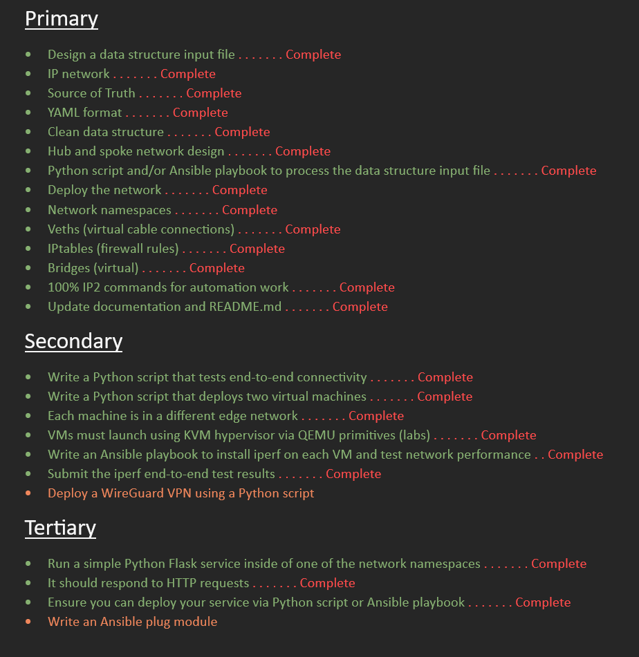
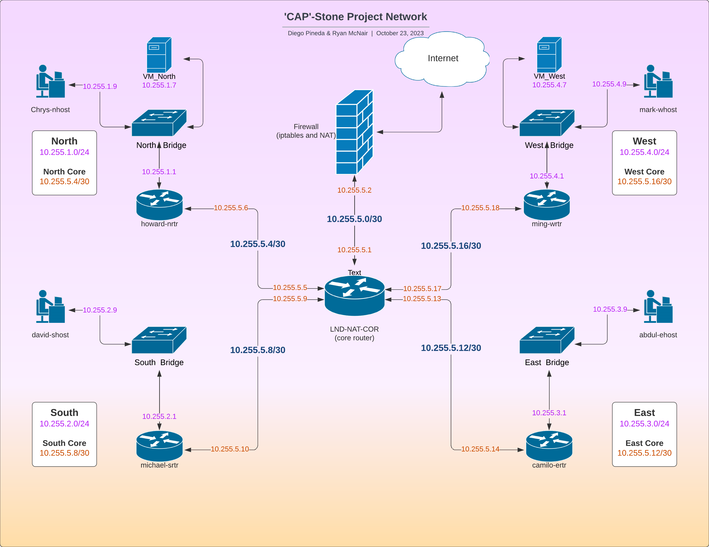

# OTS Capabilities Acceleration Program (CAP)
## 'CAP'Stone Network Automation Project 
## [![License][License-img]][License-url]       

[License-img]: https://img.shields.io/github/license/larymak/Python-project-Scripts
[License-url]: https://www.gnu.org/licenses/gpl-3.0.en.html

#### Primary Contributions by [Diego Pineda](https://github.com/diegozpineda) and [Ryan McNair](https://github.com/blacwolf4)

    This project was designed for and created as a practice to simulate a real-world scenario for building a network using 
    automation tools.

    The entire project has been done using Ansible (with a bit support from a Python script or two), and although we did 
    hard-code some data, most of the Playbooks are setup to be dynamic. If the data file is updated 95% of the code will
    work without being altered.

### Objectives
**Primary Objectives** - These tasks are considered basic items that were learned during the training course.

**Secondary Objectives** - These tasks are considered to be more difficult and were discussed in class, but not necessarily mastered.

**Tertiary Objectives** - These tasks build upon all of what we learned and require additional information that was not learned in class.
    

### Network Topology
A visual diagram of the network topology can be found below (or in the [images directory](images)).
    
    The network consists of a core router that is connected to the Internet and four
    internal routers. Each of the internal routers is connected to a bridge, and each
    bridge has a host connected. By design this network has been built for expandability, but not
    for redundancy or for being highly available.

    
### Ansible Playbook Code Files
- [Data Structure File](net_datastructure-new3.yml)
- [CAP Stone Main Deployment Playbook](cap_deployment.yml)
- [Deploy Host and Router Namespaces](net_playbook-namespace.yml)
- [Deploy Bridge Interfaces (Virtual Switch)](net_playbook-bridgecreate.yml)
- [Deploy Host Veths (Virtual Connections)](net_playbook-vtest-host.yml)
- [Deploy Router Veths (Virtual Connections)](net_playbook-vtest-routers.yml)
- [Assign LAN Host IP Addresses & Enable Veths](net_playbook-interface-lan.yml)
- [Assign LAN Router IP Addresses & Enable Veths](net_playbook-interface-wan-local.yml)
- [Deploy Core Router Veths](net_playbook-vtest-routers-core.yml)
- [Assign LAN Router and Core Router IP Addresses](net_playbook-interface-wan-core.yml)
- [Deploy NAT Router Interfaces and IP Addresses](net_playbook-interface-nat.yml)
- [Enable IP Forwarding](net_playbook-ip-forwarding.yml)
- [Deploy IP Routes](net_playbook-ip-routes.yml)
- [Enable iptables (Linux Firewall)](net_playbook-iptables.yml)
- [Launch Virtual Machines (VMs) via Python Script](net_playbook-vm-launch.yml)
- [Install and Launch iPerf on VMs](net_playbook-vm-iperf.yml)
- [Ping Test of Entire Network](net_playbook-ping.yml)
- [iPerf Test Results to VMs](net_playbook-iperf.yml)
- [Launch Flask Server via gunicorn in abdul-ehost namespace](net_playbook-flask-server.yml)

### Additional Code and Data Files
- [Ansible configuration file](.ansible.cfg)
- [Virtual Environment Teardown](cleanup-all.sh)
- [Github Commit and Push](gitcap.sh)
- [Virtual Machine Depoyment Python Script](vm-deploy.py)
- [Host file](ansible-config/hosts)
- [Flask Server Python Script Files](flask-server)
- [Virtual Machine Configuration Files](vm-config)
##
###
