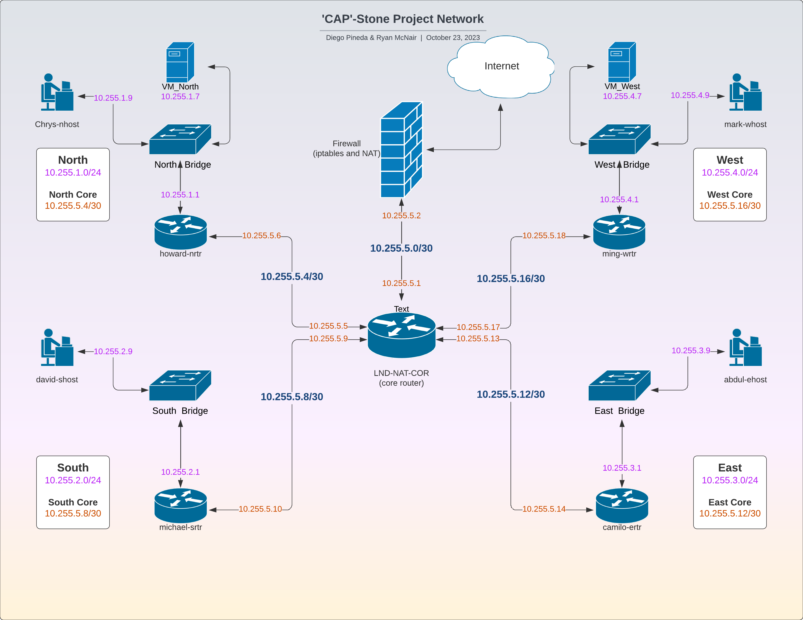

# OTS Capabilities Acceleration Program (CAP)
## 'CAP'Stone Network Automation Project 
## [![License][License-img]][License-url]       

[License-img]: https://img.shields.io/github/license/larymak/Python-project-Scripts
[License-url]: https://www.gnu.org/licenses/gpl-3.0.en.html

#### Primary Contributions by [Diego Pineda](https://github.com/diegozpineda) and [Ryan McNair](https://github.com/blacwolf4)

    This project was designed for and created as a practice to simulate a real-world scenario for building a network using 
    automation tools.

    The entire project has been done using Ansible (with a bit support from a Python script or two), and although we did 
    hard-code some data, most of the Playbooks are setup to be dynamic. If the data file is updated 95% of the code will
    work without being altered.

### 1) Objectives

### 2) Network Topology
    A visual diagram of the network topology can be found below (also in the [images](images) folder).
    
    The network consists of a core router that is connected to the Internet and four
    internal routers. Each of the internal routers is connected to a bridge, and each
    bridge has a host connected. By design this network has been built for expandability, but not
    for redundancy or for being highly available.

    
### 2) Ansible Playbook
#### - [Deploy Namespaces Play](net_playbook-namespace.yml)
#### - Deploy Bridge Interfaces Play
#### - Deploy Host Veths Play
#### - Deploy Router Veths Play
#### - Assign LAN Host IPs Play
#### - Assign WAN Host IPs Play
#### - Deploy Core Router Veths Play
#### - Assign Core Router IPs Play
#### - Assign WAN Core IPs Play
#### - Creat NAT Interfaces Play
#### - Enable IP Forwarding Play
#### - Enable IP Routes Play
#### - Enable IPTables Play
#### - Enable Network-Wide Ping Play

